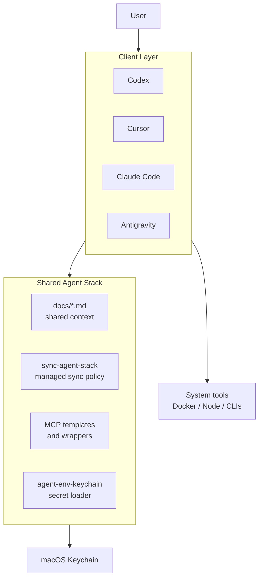
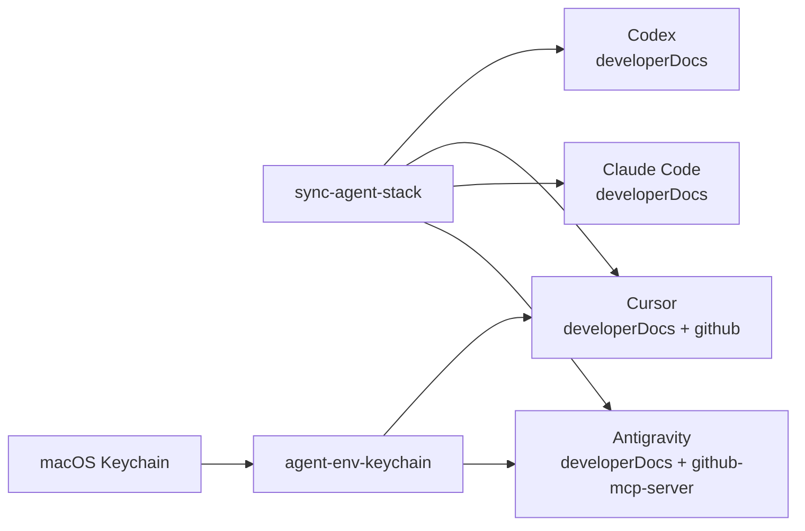

# Agent Stack

A local runtime layer for managing multiple AI coding clients on one machine.

`agent-stack` exists to solve one operational problem:

You should not have to rebuild the same MCP config, secret-loading path, and operating context every time you install a new coding agent.

Instead of treating each client as its own silo, this repo provides:

- a shared MCP layer
- a shared documentation layer
- a shared secret-loading strategy
- a rules-driven sync mechanism for supported clients

Current clients:

- Codex
- Cursor
- Claude Code
- Antigravity

## At a Glance

`agent-stack` is for people who are already using more than one AI coding client and want the machine underneath them to feel consistent.

It is designed to reduce four kinds of repeated work:

- re-adding the same MCP tools in every client
- re-storing the same credentials in multiple places
- re-explaining the same operating rules in client-specific formats
- re-auditing which client should own which capability

The repo treats local AI tooling as infrastructure, not as app-by-app setup.

## What This Is

`agent-stack` is not an app. It is a local platform layer.

It standardizes how multiple AI clients on the same machine access:

- shared MCP servers
- shared operational docs
- shared secret-loading behavior
- client-specific allowlists and exceptions

The goal is not to make every client identical. The goal is to make them predictable.

## Who This Is For

This repo is most useful if you:

- actively use more than one coding agent
- want MCP access to be managed intentionally rather than ad hoc
- care about keeping secrets out of repo files and scattered client configs
- want a repeatable local runtime you can evolve over time

If you only use one client and do not care about shared local infrastructure yet, this repo is probably more than you need.

## Why This Exists

Without a shared runtime layer, the default workflow usually looks like this:

- install a new client
- re-enter tokens
- re-add GitHub or Figma tools
- re-figure out where config files live
- re-document rules in a client-specific prompt format

That does not scale.

This repo treats local AI tooling more like developer infrastructure:

- tools live behind MCP where practical
- durable instructions live in Markdown
- secrets live in Keychain
- each client keeps only a thin adapter config

## Design Principles

- Reusable capabilities belong in MCP servers, not in one-off client prompts.
- Durable guidance belongs in Markdown, not only in client-specific memory or rules.
- Secrets should load from macOS Keychain, not from plaintext runtime files.
- Sync should be rules-driven and idempotent, not “smart” in an unreliable way.
- Built-in client plugins and custom MCP servers should not overlap unless there is a clear reason.

## Architecture

High-level view:



Managed configuration flow:



Current client policy:

| Client | Managed entries | Notes |
|---|---|---|
| Codex | `developerDocs` | Built-in plugins cover other major domains |
| Cursor | `developerDocs`, `github` | GitHub runs through the Keychain wrapper |
| Claude Code | `developerDocs` | Minimal managed setup |
| Antigravity | `developerDocs`, `github-mcp-server` | Existing non-managed MCP entries are preserved |

## Runtime Model

This repo uses three different runtime surfaces.

### 1. Shared Docs

Markdown files in `docs/` are the cross-client source of truth for:

- architecture
- rules
- commands
- workflow policy

### 2. Shared MCP Policy

The repo contains:

- MCP registry templates
- per-client templates
- a sync script that applies managed entries only where they belong

### 3. Shared Secret Loader

Real secrets are expected to live in macOS Keychain.

This repo uses:

- `bin/agent-env-keychain`

to expose those secrets to MCP subprocesses at runtime.

`env/common.env` is no longer the primary secret store. It remains only as:

- a placeholder
- a key name reference
- a bootstrap convenience file

## Repository Layout

```text
~/.agent-stack/
  README.md
  .gitignore
  bin/
    agent-env
    agent-env-keychain
    sync-agent-stack
  docs/
    AGENTS.md
    CLIENT-SETUP.md
    CODING-STANDARDS.md
    COMMANDS.md
    RULES.md
    STACK.md
    WORKFLOWS.md
  env/
    common.env
    common.env.example
  mcp/
    registry/
      base.mcp.json
  templates/
    codex/
    cursor/
    claude-code/
    antigravity/
```

## Managed Clients

The sync tool is intentionally conservative. It only manages entries with an explicit policy.

| Client | Managed by `sync-agent-stack` | Notes |
|---|---|---|
| Codex | `developerDocs` | Avoids duplicating built-in GitHub and Figma plugin coverage |
| Cursor | `developerDocs`, `github` | GitHub runs through the Keychain wrapper |
| Claude Code | `developerDocs` | Current endpoint may still be subject to network access restrictions |
| Antigravity | `developerDocs`, `github-mcp-server` | Existing non-managed MCP entries are preserved |

## Security Model

This repo assumes:

- the machine is trusted
- the user controls which clients are installed and run
- secrets should not be committed into git or duplicated across client configs

Current approach:

- real secrets are stored in macOS Keychain
- runtime secret loading goes through `bin/agent-env-keychain`
- client configs reference env names, not literal tokens
- `env/common.env` is blank by default and ignored by git

What this solves:

- avoids storing active tokens in repo files
- avoids duplicating secrets across multiple client configs
- keeps a single local secret-loading path

What this does not solve:

- any agent with full local file and process access is still part of your trust boundary
- network-level access controls are still external to this repo

## Getting Started

### Prerequisites

- macOS
- Docker
- GitHub CLI if you want GitHub repo automation
- whichever AI clients you actually use

### Bootstrap

1. Clone the repo into `~/.agent-stack`.
2. Store the required secrets in macOS Keychain.
3. Run the sync script:

```bash
~/.agent-stack/bin/sync-agent-stack
```

4. Restart the affected clients.

## Daily Operations

### Re-apply managed client config

```bash
~/.agent-stack/bin/sync-agent-stack
```

Use this after:

- pulling updates to this repo
- installing a new supported client
- changing managed sync rules

### Load a command with plaintext placeholder env

```bash
~/.agent-stack/bin/agent-env <command> ...
```

This is mostly for bootstrap or compatibility, not the preferred runtime path.

### Load a command with Keychain-backed secrets

```bash
~/.agent-stack/bin/agent-env-keychain <command> ...
```

This is the preferred runtime path for secret-bearing MCP subprocesses.

## How Sync Works

`bin/sync-agent-stack` does four things:

1. Detects whether a supported client exists.
2. Detects whether the relevant live config file exists or should exist.
3. Applies only the MCP entries that are explicitly allowed for that client.
4. Leaves unrelated config intact.

What it does not do:

- it does not try to infer whether every built-in plugin is equivalent to every MCP server
- it does not try to merge arbitrary third-party policy
- it does not delete unrelated user config

This is deliberate. The script is meant to be predictable, not clever.

## Documentation Map

- `docs/AGENTS.md`: top-level operating guidance for human and AI readers
- `docs/STACK.md`: layer model and scope
- `docs/WORKFLOWS.md`: sync and extension workflows
- `docs/RULES.md`: policy and guardrails
- `docs/CLIENT-SETUP.md`: per-client notes
- `docs/COMMANDS.md`: common command patterns
- `docs/CODING-STANDARDS.md`: cross-client authoring norms

## FAQ

### Why not just keep everything in one env file?

Because that solves convenience, not security. This repo prefers Keychain at runtime and keeps `common.env` as a placeholder only.

### Why not auto-detect whether every client already has an equivalent built-in capability?

Because that becomes fragile very quickly. Built-in plugins change, naming changes, and capability overlap is often ambiguous. This repo uses explicit policy instead.

### Why not configure every client identically?

Because identical is not the goal. Some clients already provide strong built-in plugins. The goal is a stable local platform, not artificial uniformity.

### Is this a framework?

No. It is a local operating layer for AI coding clients on one machine.

## Related Work

This repo is not starting from a blank slate. Adjacent work already exists in a few categories:

- multi-client MCP setup guides
- shared `mcp.json` and dotfiles repositories
- MCP installers and host-specific bootstrap tools
- OS keyring and Keychain-based secret handling for AI tooling

What this repo focuses on is the local runtime layer across multiple AI coding clients on one machine.

In practice, that means combining:

- rules-driven client sync
- shared Markdown operating context
- MCP templates and wrappers
- Keychain-backed secret loading

into one coherent, portable setup.

## Status

This repo is intentionally opinionated and still early-stage. It is meant to be iterated as MCP support and local agent workflows mature.
